# The Pasifika Web3 Tech Hub - Backend

<div align="center">
  
  <h2>Building the Future of Pacific Island Web3 Technology</h2>
  <p><em>Established 2025</em></p>
  <hr />
</div>

## Overview

The Pasifika Web3 Tech Hub backend is a decentralized physical infrastructure network (DePIN) designed for Pacific Island communities. The platform leverages Linea's zkEVM Layer-2 technology and the native PASIFIKA token (PSF) to create a sustainable economic ecosystem.

## Technical Specifications

- **Solidity Version:** 0.8.19 and 0.8.20
- **OpenZeppelin:** v5.3.0
- **Development Framework:** Foundry

## Current Components

The backend currently consists of the following implemented components:

### Smart Contract System

The smart contract system is built using Solidity and Foundry development toolkit:

- **PSFToken Contract**: Core ERC-20 token (PSF) with:
  - Governance extensions (ERC20Votes)
  - Permit functionality (ERC20Permit)
  - Access control for roles
  - Token burning mechanism
  - Vesting schedules for team, investors, and partners
  - Staking functionality
  - Pausability for emergency situations

- **PSFStaking Contract**: Advanced staking mechanism with:
  - Multiple staking tiers (Basic, Silver, Gold, Platinum, Validator, NodeOperator)
  - Duration-based reward multipliers for longer staking periods
  - Special roles for validators and node operators
  - Dynamic governance weight calculation
  - Flexible admin controls for tier requirements and bonuses
  - Reward distribution system
  - Security features including pausability and emergency withdrawals

- **PasifikaDynamicNFT Contract**: NFT system with:
  - Customizable metadata and on-chain state
  - Cultural context verification
  - Usage permissions and attestations
  - State history tracking
  - Transfer restrictions
  
- **PasifikaMarketplace Contract**: NFT marketplace with:
  - Fixed price and auction listings
  - Bidding mechanism for auctions
  - Escrow functionality
  - Dispute resolution
  - Fee management system
  - Admin controls

- **PasifikaDAO Contract**: Governance system with:
  - Full compatibility with OpenZeppelin v5.3.0
  - Time-locked proposal execution
  - Role-based access control with admin and moderator roles
  - Quorum-based voting
  - Configurable voting delay, voting period, and proposal threshold
  - Parameter adjustment functions for governance fine-tuning

## Project Status: Proof of Concept (POC)

This repository currently contains 8 out of the 16 planned smart contracts for the full Pasifika Web3 Tech Hub ecosystem. This represents our Proof of Concept (POC) implementation, which demonstrates core functionalities and integration patterns. 

The remaining 8 contracts will be developed before the production release, which will complete the full suite of planned functionalities as outlined in the project documentation.

### 8 Remaining Contracts for Production Release

The following contracts are planned for implementation before the production release:

1. **PasifikaOracle**: Oracle system for fetching and verifying off-chain data.
2. **CulturalRegistry**: Registry for cultural artifacts, traditions, and intellectual property.
3. **RoyaltyDistribution**: System for distributing royalties to creators and communities.
4. **ValidatorRegistry**: Registry and management system for network validators.
5. **NodeRegistry**: Registry and management system for infrastructure node operators.
6. **WorkingGroups**: Coordination system for specialized working groups within the ecosystem.
7. **DisputeResolution**: System for resolving disputes in the marketplace and ecosystem.
8. **AgentCoordination**: Framework for coordinating AI agent interactions and rewards.

These contracts will complete the full technical architecture outlined in the project documentation.

## Smart Contracts Overview

The Pasifika Web3 Tech Hub backend currently includes the following smart contracts:

### Core Contracts

- **PSFToken**: ERC20 token with governance capabilities, the native token of the Pasifika ecosystem.
  
- **MockToken**: Simplified token implementation for testing governance functionality.

- **PasifikaDAO**: Governance contract that allows token holders to propose, vote, and execute proposals through a timelock mechanism.

- **PSFStaking**: Advanced staking mechanism with tiers, duration-based rewards, and governance weight calculation.

- **PasifikaTreasury**: Treasury management contract with:
  - Multi-signature control for fund management
  - Budget allocation system with categories
  - Spending proposal and approval workflow
  - Fund distribution with proper authorization checks
  - Emergency recovery mechanisms

### NFT Contracts

- **PasifikaDynamicNFT**: Dynamic NFT implementation with on-chain state changes, cultural context verification, and usage permissions.
  
- **DigitalContentNFT**: Specialized NFT for digital content with access controls, usage rights, and cultural context preservation.
  
- **PhysicalItemNFT**: NFTs representing physical items with quality metrics, supply chain tracking, and authenticity verification.

### Marketplace Contracts

- **PasifikaMarketplace**: Marketplace for trading NFTs with fixed price and auction listings, escrow functionality, and dispute resolution.
  
- **FeeManager**: Manages, calculates, and distributes marketplace fees to various stakeholders including creators, community fund, and platform treasury.

### Governance & Coordination

- **WorkingGroups**: Manages working groups and validators, with staking, reputation, and certification functionality for ecosystem governance.

## Smart Contract Architecture

### Dependencies and Libraries

#### OpenZeppelin Contracts

This project uses **OpenZeppelin Contracts v5.3.0** for implementing secure, standard-compliant smart contracts.

- All contracts use the same version (v5.3.0) to ensure compatibility
- Contracts inherit from OpenZeppelin's battle-tested implementations
- Compiler uses IR-based pipeline for optimization

**Key OpenZeppelin components used:**
- Access Control (`AccessControl.sol`)
- Token Standards (`ERC20.sol`, `ERC721.sol`)
- Token Extensions (`ERC20Votes.sol`, `ERC721URIStorage.sol`) 
- Security Utilities (`Pausable.sol`, `ReentrancyGuard.sol`)
- Governance (`Governor.sol`, `GovernorTimelockControl.sol`, `GovernorSettings.sol`, etc.)

**Best Practices for OpenZeppelin Integration:**
1. **Version Consistency**: Always maintain consistent versions across all OpenZeppelin dependencies
2. **Inheritance**: Use inheritance instead of reimplementing standard functionality
3. **Override Safety**: When overriding OpenZeppelin functions, always call the parent implementation
4. **Import Specificity**: Import only the specific contracts you need rather than full libraries
5. **Testing**: Thoroughly test all custom extensions to OpenZeppelin contracts

### Currently Implemented

#### PSFToken.sol

Core ERC-20 token contract for the PASIFIKA token (PSF).

**Key Features:**
- Standard ERC-20 functionality
- Governance extensions (ERC20Votes)
- Vesting schedules for team, investors, and partners
- Staking functionality
- Role-based access control
- Pausability for emergency situations

**Contract Components:**
- Max supply of 1 billion tokens
- Role definitions (ADMIN, MINTER, BURNER, TREASURY)
- Vesting schedule management
- Staking functionality
- Token burning mechanism

#### PSFStaking.sol

Advanced staking contract that enables users to stake PSF tokens with varying tiers and durations.

**Key Features:**
- Tiered staking system with different rewards based on amount and duration
- Duration-based multipliers for longer-term stakers
- Special validator and node operator tiers with additional permissions
- Dynamic governance weight calculation based on stake amount, tier, and remaining duration
- Comprehensive reward calculation system
- Administrative controls for adjusting tiers, rewards, and bonuses
- Emergency controls including pausability and emergency withdrawals

**Contract Components:**
- StakeInfo structure for tracking stakes
- TierRequirement structure for defining tier parameters
- DurationBonus structure for rewarding longer-term stakers
- Role-based access control (ADMIN, REWARDS_DISTRIBUTOR, VALIDATOR, NODE_OPERATOR)
- Functions for creating, increasing, extending, and unstaking
- Reward calculation and claiming mechanism
- Governance weight calculation

#### PasifikaMarketplace.sol

NFT marketplace contract that enables buying, selling, and auctioning NFTs.

**Key Features:**
- Fixed price and auction listings
- Bidding mechanism for auctions
- Escrow functionality
- Dispute resolution
- Fee management
- Admin controls

**Contract Components:**
- Listing structure for tracking listed items
- Bid structure for tracking auction bids
- Role-based access control (ADMIN, MODERATOR, FEE_MANAGER)
- Escrow management
- Auction timing and finalization

#### PasifikaDAO.sol

Governance contract that enables token holders to propose, vote on, and execute proposals.

**Key Features:**
- Full compatibility with OpenZeppelin v5.3.0 Governor contracts
- Time-locked proposal execution through GovernorTimelockControl
- Configurable voting parameters through GovernorSettings
- Token-based voting power through GovernorVotes
- Quorum-based decision making through GovernorVotesQuorumFraction
- Role-based access control for administrative functions

**Contract Components:**
- Role definitions (ADMIN_ROLE, MODERATOR_ROLE)
- Voting delay, voting period, and proposal threshold settings
- Quorum percentage configuration
- Proposal lifecycle management (propose, vote, queue, execute)
- Administrative functions for parameter adjustments
- Override implementations for OpenZeppelin v5.3.0 compatibility

#### PasifikaTreasury.sol

Treasury management contract with multi-signature control for fund management.

**Key Features:**
- Multi-signature control for fund management
- Budget allocation system with categories
- Spending proposal and approval workflow
- Fund distribution with proper authorization checks
- Emergency recovery mechanisms

**Contract Components:**
- Role definitions (ADMIN, TREASURY_MANAGER)
- Budget category management
- Spending proposal and approval workflow
- Fund distribution with authorization checks
- Emergency recovery mechanisms

## Process Flow Diagram

```mermaid
graph TD
    %% Current Implemented Contracts - Solid Lines
    A[User] --> B[PSFToken Contract]
    B --> C[Token Transfers]
    B --> D[Governance Voting]
    B --> E1[Basic Staking]
    B --> F[Vesting Management]
    
    A --> G[PSFStaking Contract]
    G --> E2[Advanced Staking]
    G --> H[Validator Management]
    G --> I[Node Operator Management]
    G --> J[Reward Distribution]
    G --> K[Governance Weight]
    
    A --> P[PasifikaDAO Contract]
    P --> Q[Proposal Creation]
    P --> R[Voting]
    P --> S[Proposal Execution]
    P --> T[Parameter Configuration]
    
    A --> U[PasifikaTreasury Contract]
    U --> V[Budget Allocation]
    U --> W[Spending Proposals]
    U --> X[Multi-sig Approvals]
    U --> Y[Fund Distribution]
    
    P -- Governance --> U[PasifikaTreasury Contract]
    
    L[Admin] --> M[Role Management]
    M --> B
    M --> G
    M --> P
    M --> U
    
    N[Treasury] --> O[Token Distribution]
    O --> B
    O --> U
    
    %% Planned Contracts For Production - Dotted Lines
    A -.-> O1[PasifikaOracle Contract]
    O1 -.-> O2[External Data Feeds]
    O1 -.-> O3[Price Information]
    
    A -.-> CR[CulturalRegistry Contract]
    CR -.-> CR1[Cultural Verification]
    CR -.-> CR2[IP Management]
    
    A -.-> RD[RoyaltyDistribution Contract]
    RD -.-> RD1[Creator Payments]
    RD -.-> RD2[Community Funds]
    
    A -.-> VR[ValidatorRegistry Contract]
    VR -.-> VR1[Validator Onboarding]
    VR -.-> VR2[Performance Tracking]
    
    A -.-> NR[NodeRegistry Contract]
    NR -.-> NR1[Node Management]
    NR -.-> NR2[Rewards Distribution]
    
    A -.-> WG[WorkingGroups Contract]
    WG -.-> WG1[Group Formation]
    WG -.-> WG2[Task Management]
    
    A -.-> DR[DisputeResolution Contract]
    DR -.-> DR1[Case Management]
    DR -.-> DR2[Resolution Voting]
    
    A -.-> AC[AgentCoordination Contract]
    AC -.-> AC1[Agent Registration]
    AC -.-> AC2[Task Assignment]
    
    %% Connections between current and planned contracts
    U -.-> RD
    P -.-> WG
    P -.-> DR
    G -.-> VR
    G -.-> NR
    
    subgraph "Smart Contract System"
        %% Current Contracts
        B
        C
        D
        E1
        F
        G
        E2
        H
        I
        J
        K
        M
        P
        Q
        R
        S
        T
        U
        V
        W
        X
        Y
        
        %% Planned Contracts
        O1
        O2
        O3
        CR
        CR1
        CR2
        RD
        RD1
        RD2
        VR
        VR1
        VR2
        NR
        NR1
        NR2
        WG
        WG1
        WG2
        DR
        DR1
        DR2
        AC
        AC1
        AC2
    end
    
    %% Legend
    subgraph Legend
        Z1[Implemented Contracts] --- Z2[Solid Lines]
        Z3[Planned Contracts] -.- Z4[Dotted Lines]
    end
```



## Deployment

Each contract has a corresponding deployment script in the `script` folder using Foundry's script system. The main deployment script is available at `deploy/deploy.sh` which provides an interactive deployment process.

For PasifikaDAO and other contracts requiring complex setup:

```shell
# Deploy PasifikaDAO with its TimelockController
$ forge script script/PasifikaDAO.s.sol --rpc-url <your_rpc_url> --broadcast

# Deploy other contracts via the unified deployment script
$ ./deploy/deploy.sh
```

## Development Tools

### Foundry

**Foundry is a blazing fast, portable and modular toolkit for Ethereum application development written in Rust.**

Foundry consists of:

-   **Forge**: Ethereum testing framework (like Truffle, Hardhat and DappTools).
-   **Cast**: Swiss army knife for interacting with EVM smart contracts, sending transactions and getting chain data.
-   **Anvil**: Local Ethereum node, akin to Ganache, Hardhat Network.
-   **Chisel**: Fast, utilitarian, and verbose solidity REPL.

### Documentation

https://book.getfoundry.sh/

## Recent Updates

### OpenZeppelin v5.3.0 Compatibility

The smart contract system has been updated to ensure full compatibility with OpenZeppelin v5.3.0:

- **PasifikaDAO**:
  - Implemented correct inheritance pattern with Governor, GovernorSettings, GovernorCountingSimple, GovernorVotes, GovernorVotesQuorumFraction, and GovernorTimelockControl
  - Added proper function overrides for all inherited methods
  - Implemented required new methods: `_queueOperations`, `_executeOperations`, and `proposalNeedsQueuing`
  - Updated function calls to use specific parent implementation references
  - Added role-based access control for administrative functions
  
- **MockToken**:
  - Updated to properly inherit from ERC20, ERC20Permit, and ERC20Votes
  - Implemented proper override patterns for `_update` and `nonces` functions
  - Added MINTER_ROLE for token minting capabilities
  - Fixed constructor parameter passing to match OpenZeppelin v5.3.0 requirements

- **PasifikaTreasury**:
  - Implemented multi-signature fund management with role-based access control
  - Created budget categorization and allocation system
  - Developed spending proposal and approval workflow with multiple signers
  - Added security features including nonReentrant modifiers and fund recovery mechanisms
  - Built with full OpenZeppelin v5.3.0 compatibility

All contracts have been verified for compatibility with OpenZeppelin v5.3.0 and compile successfully.

## Usage

### Build

```shell
$ forge build
```

### Test

```shell
$ forge test
```

### Format

```shell
$ forge fmt
```

### Gas Snapshots

```shell
$ forge snapshot
```

### Anvil

```shell
$ anvil
```

### Deploy

```shell
$ forge script script/Counter.s.sol:CounterScript --rpc-url <your_rpc_url> --private-key <your_private_key>
```

### Cast

```shell
$ cast <subcommand>
```

### Help

```shell
$ forge --help
$ anvil --help
$ cast --help
